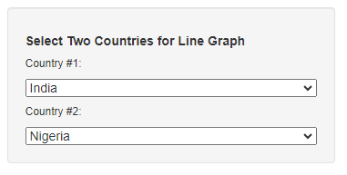
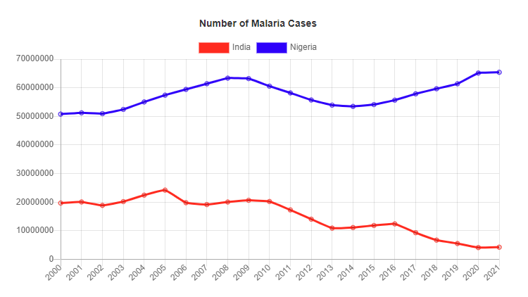
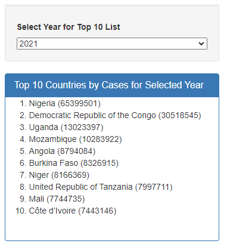
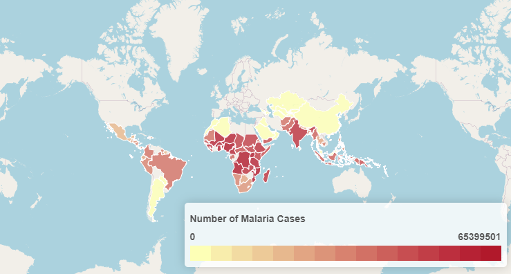

# Project 3
Topic: Incidence of Malaria Worldwide 

Members: Kokoe Amegno, Olivia Ramsey, Joanna Santana, Aaron Schneberger, Cayla Valentine

Description: Malaria is a disease caused by a plasmodium parasite, transmitted by the bite of infected mosquitoes.The disease symptoms are chills, fever, and sweating, usually occurring a few weeks after being bitten. In 2021 alone, there were 247 millions malaria cases with 619,000 deaths. People traveling to areas where malaria is common typically take protective drugs before, during, and after their trip. Treatment includes antimalarial drugs.

This project's primary goal is to identify countries that are most affected by this disease and how the number of cases has changed over the years. These visualizations are beneficial when making travel decisions and help the international medical community focus their resources and research to the most affected areas.

Developed with: Python (Jupyter Notebook), HTML, CSS, Javascript (D3, Leaflet, Chart).

Scripts and files to demonstrate the project's key features include:

ETL_Project_3.ipynb houses the extract, transform, and load process. The data was originally in CSV format and obtained from the World Health Organization. The data was transformed into Pandas dataframes for cleaning and transformation and then exported as updated CSV files. 

Next we used terminal/command prompt to create a SQLite database and upload our data.

The file countries_list.ipynb creates a list of all the countries across our database tables. It also uses a geoapify API call to get each country's latitude and longitude. This did not end up being used as we ended up using geojson data to create the choropleth, but could be used later if we choose to reformat the map.

The file app.py created a flask app that got the database tables into JSON format and then flask_to_json.ipynb converted the flask result into a json file. 

The file logic-lineGraph.js utilized the Chart.js library to create a dynamic line graph that plots malaria rates over time which can be utilized to compare the number of malaria cases of 2 countries from 2000-2021. Two dropdown menus update the countries displayed on the line graph.

The file logic-choropleth-top-10 utilized Leaflet.choropleth to create a map that illustrates malaria cases per country. The color of the country gets darker as the number of malaria cases gets larger. The file also creates a top 10 list of countries with highest malaria cases for a particular year. The year that the top 10 list and choropleth map display is controlled by a dropdown menu.

The dashboard was designed with the index.html file which contains the webpage contents and layout and accesses all the JavaScript libraries and files being used in the dashboard. The styling of the dashboard is determined by style.css.  

Project visualizations:

A dropdown menu that allows you to select 2 unique countries for malaria cases over time (2000-2021) on a line graph. 

A list of top 10 countries with highest malaria rates from the year chosen in the dropdown menu.

Malaria cases per country and region - When hovering over a country, stats appear in a textbox.

Malaria data source: https://www.who.int/data/gho/data/themes/topics/topic-details/GHO/malaria-cases-deaths

GeoJSON data source: https://datahub.io/core/geo-countries

To learn more about malaria, visit World Malaria Report 2022: https://www.who.int/publications/i/item/9789240064898
